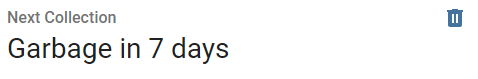
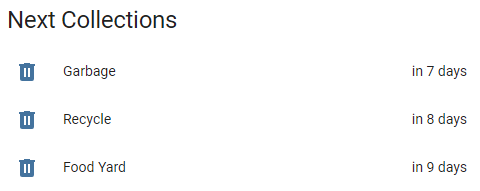
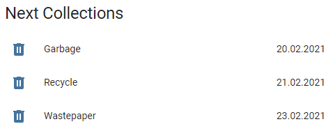
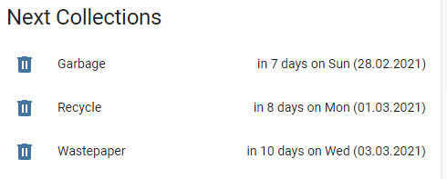
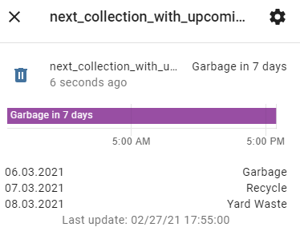
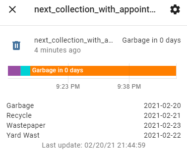
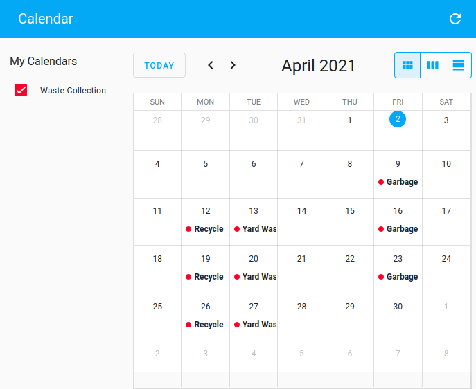

# Waste Collection Schedule

Waste Collection Schedule provides schedules from waste collection service providers to Home Assistant. Additionally, it supports schedules from generic ICS files which can be stored locally or fetched from a web site. There is a high flexibility in providing the information to be displayed.

*For developers:* This framework can be easily enhanced to support further waste collection service providers or other services which provide schedules.

If you like this component, please give it a star on [github](https://github.com/mampfes/hacs_waste_collection_schedule).

## Table of Contents

- [Examples](#examples)
- [Supported Service Providers](#supported-service-providers)
- [Installation](#installation)
- [Configuration](#configuration)
- [FAQ](#faq)
- *For developers*: [How to add new sources](#how-to-add-new-sources)

## Examples

A complete example can be found [here](./doc/configuration.yaml).

Per default (without further configuration), the time to the next collection will be shown in an [entity card](https://www.home-assistant.io/lovelace/entity/):



You can also setup dedicated entities per waste type and show the schedule in various formats:





The information in the more-info popup can be displayed in different formats:

1. List of upcoming collections:

   

2. List of waste types and collection date:

   

[Button Card](https://github.com/custom-cards/button-card) can be used to create individual Lovelace cards:


The collection schedule will be automatically integrated into the Home Assistant calendar:


## Supported Service Providers

Currently the following service providers are supported:

- [Generic ICS / iCal File](./doc/source/ics.md)
- [Static source](./doc/source/static.md)

### Australia

- [Banyule City Council](./doc/source/banyule_vic_gov_au.md)
- [Belmont City Council](./doc/source/belmont_wa_gov_au.md)
- [Brisbane City Council](./doc/source/brisbane_qld_gov_au.md)
- [Campbelltown City Council](./doc/source/campbelltown_nsw_gov_au.md)
- [City of Canada Bay Council](./doc/source/canadabay_nsw_gov_au.md)
- [Inner West Council (NSW)](./doc/source/innerwest_nsw_gov_au.md)
- [Ku-ring-gai Council](./doc/source/kuringgai_nsw_gov_au.md)
- [Macedon Ranges Shire Council, Melbourne](./doc/source/mrsc_vic_gov_au.md)
- [Maroondah City Council](./doc/source/maroondah_vic_gov_au.md)
- [Melton City Council, Melbourne](./doc/source/melton_vic_gov_au.md)
- [North Adelaide Waste Management Authority, South Australia](./doc/source/nawma_sa_gov_au.md)
- [RecycleSmart](./doc/source/recyclesmart_com.md)
- [Stonnington City Council, Melbourne](./doc/source/stonnington_vic_gov_au.md)
- [The Hills Council, Sydney](./doc/source/thehills_nsw_gov_au.md)
- [Wyndham City Council, Melbourne](./doc/source/wyndham_vic_gov_au.md)

### Austria

- [BMV.at](./doc/source/bmv_at.md)
- [Data.Umweltprofis](./doc/source/data_umweltprofis_at.md)
- [Korneuburg Stadtservice](./doc/source/korneuburg_stadtservice_at.md)
- [WSZ-Moosburg.at](./doc/source/wsz_moosburg_at.md)

### Belgium

- [Hygea.be](./doc/source/hygea_be.md)
- [Recycle! / RecycleApp.be](./doc/source/recycleapp_be.md)

### Canada
- [City of Toronto](./doc/source/toronto_ca.md)

### Germany

- [Abfall.IO / AbfallPlus.de](./doc/source/abfall_io.md)
- [AbfallNavi.de (RegioIT.de)](./doc/source/abfallnavi_de.md)
- [Abfallkalender Würzburg](./doc/source/wuerzburg_de.md)
- [Abfalltermine Forchheim](./doc/source/abfalltermine_forchheim_de.md)
- [Abfallwirtschaft Bremen](./doc/source/c_trace_de.md)
- [Abfallwirtschaft Landkreis Harburg](./doc/source/aw_harburg_de.md)
- [Abfallwirtschaft Landkreis Wolfenbüttel](./doc/source/alw_wf_de.md)
- [Abfallwirtschaft Neckar-Odenwald-Kreis](./doc/source/awn_de.md)
- [Abfallwirtschaft Rendsburg](./doc/source/awr_de.md)
- [Abfallwirtschaft Stuttgart](./doc/source/stuttgart_de.md)
- [Abfallwirtschaft Südholstein](./doc/source/awsh_de.md)
- [Abfallwirtschaft Zollernalbkreis](./doc/source/abfall_zollernalbkreis_de.md)
- [ART Trier](./doc/source/art_trier_de.md)
- [AVL Ludwigsburg](./doc/source/avl_ludwigsburg_de.md)
- [AWB Bad Kreuznach](./doc/source/awb_bad_kreuznach_de.md)
- [AWB Esslingen](./doc/source/awb_es_de.md)
- [AWB Landkreis Augsburg](./doc/source/c_trace_de.md)
- [AWB Limburg-Weilburg](./doc/source/awb_lm_de.md)
- [AWB Oldenburg](./doc/source/awb_oldenburg_de.md)
- [AWBKoeln.de](./doc/source/awbkoeln_de.md)
- [AWIDO-online.de](./doc/source/awido_de.md)
- [Berlin-Recycling.de](./doc/source/berlin_recycling_de.md)
- [Bogenschuetz-Entsorgung.de](./doc/source/infeo_at.md)
- [BSR.de / Berliner Stadtreinigungsbetriebe](./doc/source/bsr_de.md)
- [C-Trace.de](./doc/source/c_trace_de.md)
- [Cochem-Zell](./doc/source/cochem_zell_online_de.md)
- [EGN-Abfallkalender.de](./doc/source/egn_abfallkalender_de.md)
- [Erlangen-Höchstadt](./doc/source/erlangen_hoechstadt_de.md)
- [Jumomind.de](./doc/source/jumomind_de.md)
- [KAEV Niederlausitz](./doc/source/kaev_niederlausitz_de.md)
- [KWB-Goslar.de](./doc/source/kwb_goslar_de.md)
- [KWU-Entsorgung](./doc/source/kwu_de.md)
- [Landkreis-Wittmund.de](./doc/source/landkreis_wittmund_de.md)
- [Landkreis Rhön Grabfeld](./doc/source/landkreis_rhoen_grabfeld.md)
- [Landkreis Schwäbisch Hall](./doc/source/lrasha_de.md)
- [Muellmax.de](./doc/source/muellmax_de.md)
- [MyMuell App](./doc/source/jumomind_de.md)
- [Neunkirchen Siegerland](./doc/source/abfall_neunkirchen_siegerland_de.md)
- [RegioEntsorgung](./doc/source/regioentsorgung_de.md)
- [Rhein-Hunsrück Entsorgung (RHE)](./doc/source/rh_entsorgung_de.md)
- [Sector27.de](./doc/source/sector27_de.md)
- [Stadtreinigung Dresden](./doc/source/stadtreinigung_dresden_de.md)
- [Stadtreinigung.Hamburg](./doc/source/stadtreinigung_hamburg.md)
- [Stadtreinigung-Leipzig.de](./doc/source/stadtreinigung_leipzig_de.md)
- [Stadt-Willich.de](.doc/source/stadt_willich_de.md)
- [StadtService Brühl](.doc/source/stadtservice_bruehl_de.md)
- [Städteservice Raunheim Rüsselsheim](./doc/source/staedteservice_de.md)
- [Südbrandenburgischer Abfallzweckverband](./doc/source/sbazv_de.md)
- [Umweltbetrieb Stadt Bielefeld](./doc/source/bielefeld_de.md)
- [WAS Wolfsburg](./doc/source/was_wolfsburg_de.md)
- [Wermelskirchen](./doc/source/wermelskirchen_de.md)

### Lithuania

- [Kauno švara](./doc/source/grafikai_svara_lt.md)

### Netherlands

- [Ximmio](./doc/source/ximmio_nl.md)
- [HVCGroep](./doc/source/hvcgroep_nl.md)

### New Zealand

- [Auckland](./doc/source/aucklandcouncil_govt_nz.md)
- [Christchurch](./doc/source/ccc_govt_nz.md)
- [Gore, Invercargill & Southland](./doc/source/wastenet_org_nz.md)
- [Horowhenua District](./doc/source/horowhenua_govt_nz.md)
- [Waipa District](./doc/source/waipa_nz.md)
- [Wellington](./doc/source/wellington_govt_nz.md)

### Norway

- [Min Renovasjon](./doc/source/minrenovasjon_no.md)
- [Oslo Kommune](./doc/source/oslokommune_no.md)

### Poland

- [Warsaw](./doc/source/warszawa19115_pl.md)
- [Multiple communities - ecoharmonogram](./doc/source/ecoharmonogram_pl.md)

### Sweden

- [Lerum.se](./doc/source/lerum_se.md)
- [Ronneby Miljöteknik](./doc/source/miljoteknik_se.md)
- [SSAM.se](./doc/source/ssam_se.md)
- [Sysav.se](./doc/source/sysav_se.md)
- [Vasyd.se](./doc/source/vasyd_se.md)

### Switzerland

- [A-Region.ch](./doc/source/a_region_ch.md)
- [Lindau.ch](./doc/source/lindau_ch.md)
- [Münchenstein](./doc/source/muenchenstein_ch.md)

### United States of America

- [PGH.ST](./doc/source/pgh_st.md)
- [Republic Services](./doc/source/republicservices_com.md)
- [Seattle Public Utilities](./doc/source/seattle_gov.md)

### United Kingdom

- [Bradford Metropolitan District Council - bradford.gov.uk](./doc/source/bradford_gov_uk.md)
- [Cambridge City Council - cambridge.gov.uk](./doc/source/cambridge_gov_uk.md)
- [Canterbury City Council - canterbury.gov.uk](./doc/source/canterbury_gov_uk.md)
- [Cheshire East Council - cheshireeast.gov.uk](./doc/source/cheshire_east_gov_uk.md)
- [Chesterfield Borough Council - chesterfield.gov.uk](./doc/source/chesterfield_gov_uk.md)
- [Colchester Borough Council - colchester.gov.uk](./doc/source/colchester_gov_uk.md)
- [Cornwall Council - cornwall.gov.uk](./doc/source/cornwall_gov_uk.md)
- [Derby City Council](./doc/source/derby_gov_uk.md)
- [Eastbourne Borough Council - lewes-eastbourne.gov.uk](./doc/source/environmentfirst_co_uk.md)
- [Elmbridge Borough Council - elmbridge_gov_uk](./doc/source/elmbridge_gov_uk.md)
- [Guildford Borough Council - guildford.gov.uk](./doc/source/guildford_gov_uk.md)
- [Harborough District Council - www.harborough.gov.uk](./doc/source/fccenvironment_co_uk.md)
- [Huntingdonshire District Council - huntingdonshire.gov.uk](./doc/source/huntingdonshire_gov_uk.md)
- [The Royal Borough of Kingston - kingston.gov.uk](./doc/source/kingston_gov_uk.md)
- [Lewes District Council - lewes-eastbourne.gov.uk](./doc/source/environmentfirst_co_uk.md)
- [London Borough of Lewisham - lewisham.gov.uk](.doc/source/lewisham_gov_uk.md)
- [Manchester City Council - manchester.gov.uk](./doc/source/manchester_uk.md)
- [Middlesbrough Countil - middlesbrough.gov.uk](./doc/source/middlesbrough_gov_uk.md)
- [Newcastle City Council - newcastle.gov.uk](./doc/source/newcastle_gov_uk.md)
- [North Somerset Council - n-somerset.gov.uk](./doc/source/nsomerset_gov_uk.md)
- [Nottingham City Council - nottinghamcity.gov.uk](./doc/source/nottingham_city_gov_uk.md)
- [Peterborough City Council - peterborough.gov.uk](./doc/source/peterborough_gov_uk.md)
- [Richmondshire District Council - richmondshire.gov.uk](./doc/source/richmondshire_gov_uk.md)
- [Rushmoor Borough Council - rushmoor.gov.uk](./doc/source/rushmoor_gov_uk.md)
- [Sheffield City Council - sheffield.gov.uk](./doc/source/sheffield_gov_uk.md)
- [South Cambridgeshire District Council - scambs.gov.uk](./doc/source/scambs_gov_uk.md)
- [South Norfolk and Broadland Council - southnorfolkandbroadland.gov.uk](./doc/source/south_norfolk_and_broadland_gov_uk.md)
- [Stevenage Borough Council - stevenage.gov.uk](./doc/source/stevenage_gov_uk.md)
- [Tewkesbury Borough Council](./doc/source/tewkesbury_gov_uk.md)
- [City of York Council - york.gov.uk](./doc/source/york_gov_uk.md)
- [Walsall Council - walsall.gov.uk](./doc/source/walsall_gov_uk.md)
- [West Berkshire Council - westberks.gov.uk](./doc/source/westberks_gov_uk.md)
- [Wiltshire Council - wiltshire.gov.uk](./doc/source/wiltshire_gov_uk.md)

## Installation

1. Ensure that [HACS](https://github.com/hacs/integration) is installed.
2. Install the "Waste Collection Schedule" integration.
3. [Configure the integration](#configuration).
4. Restart Home Assistant.

In case you would like to install manually:

1. Copy the folder `waste_collection_schedule` to `custom_components` in your Home Assistant `config` folder.
2. [Configure the integration](#configuration).
3. Restart Home Assistant.

## Configuration

The configuration consists of two entries in the file `configuration.yaml`:

1. Source configuration

   For each service provider, a source has to be added to the configuration. The source takes care of the arguments which are required to get the correct information from the service provider's web page, e.g. district, city, street, house number, etc.

   If you have to fetch data from multiple service providers, you have to add multiple sources. You can also add the same service provider multiple times (which only makes sense if you use this with different arguments), e.g. if you are looking for displaying the waste collection schedules for multiple districts.

2. Sensor configuration

   A sensor is used to visualize the retrieved information, e.g. waste type, next collection date or number of days to next collection. The sensor state (which is shown in a Lovelace card) can be customized using templates. As an example, you may display the collection type only or the next collection date or a combination of all available information.

   You can also add multiple sensors per source if you are going to display the information in separate entities like the available collection types or the next collection date.

   If you are looking for displaying one entity per collection type, you just have to add one sensor per collection type.

## 1. Configure the source(s)

```yaml
waste_collection_schedule:
  sources:
    - name: SOURCE
      args:
        SOURCE_SPECIFIC_ARGUMENTS
      customize:
        - type: TYPE
          alias: ALIAS
          show: SHOW
          icon: ICON
          picture: PICTURE
          use_dedicated_calendar: USE_DEDICATED_CALENDAR
          dedicated_calendar_title: DEDICATED_CALENDAR_TITLE
      calendar_title: CALENDAR_TITLE
  fetch_time: FETCH_TIME
  random_fetch_time_offset: RANDOM_FETCH_TIME_OFFSET
  day_switch_time: DAY_SWITCH_TIME
  separator: SEPARATOR
```

### Configuration Variables

**sources**

*(list) (required)*

List of service providers (waste collectors). See [Source Configuration Variables](#source-configuration-variables) for a list of available configuration variables.

**fetch_time**

*(time) (optional, default: ```"01:00"```)*

Time of day when to fetch new data from the source. Data will be fetched once per day.

**random_fetch_time_offset**

*(int) (optional, default: ```60```)*

Random offset to the `fetch_time` in minutes. Used to distribute the fetch commands of all Home Assistant instances over a larger period of time to avoid peak loads at the service providers.

**day_switch_time**

*(time) (optional, default: ```"10:00"```)*

Time of day when today's collection is going to expire and hence will not be displayed anymore.

How it works: If you set the ```day_switch_time``` to 10:00 the sensor will display today's collections until 10:00. After 10:00, today's collections will not be displayed anymore.

**separator**

*(string) (optional, default: ```", "```)*

Used to join entries if there are multiple entries for one day (n/a if value_templates are used).

### Source Configuration Variables

**name**

*(string) (required)*

Name of the source (service provider). Equates to the file name (without ```.py```) of the source. See [Supported Service Providers](#supported-service-providers) for a list of available sources.

**args**

*(dict) (optional)*

Source (service provider) specific arguments, e.g. district, city, street, waste type, etc. See [Supported Service Providers](#supported-service-providers) for details.

**customize**

*(dict) (optional)*

Used to customize the retrieved data from a source (service provider). See [Customize Source](#customize-source) for a list of available configuration variables.

**calendar_title**

*(string) (optional)*

Alternative title for source in Home Assistant calendar.

### Customize Source

Used to customize the retrieved data from a source (service provider).

**type**

*(dict) (required)*

Type of waste as it has been retrieved by the source (service provider).

**alias**

*(string) (optional, default: ```None```)*

Optional, usually better readable name for type of waste to be collected.

**show**

*(boolean) (optional, default: ```True```)*

Show or hide collections with the given waste type.

**icon**

*(string) (optional, default: ```None```)*

Alternative icon for waste type.

**picture**

*(string) (optional, default: ```None```)*

Optional picture for waste type.

**use_dedicated_calendar**

*(boolean) (optional, default: ```False```)*

Create a dedicated calendar for this type.

**dedicated_calendar_title**

*(string) (optional, default: ```None```)*

Optional title of the dedicated calendar. If not set, the waste type will be used.

## 2. Add sensor(s) to a source

Add the following lines to your `configuration.yaml` file:

```yaml
sensor:
  - platform: waste_collection_schedule
    source_index: SOURCE_INDEX
    name: NAME
    details_format: DETAILS_FORMAT
    count: COUNT
    leadtime: LEADTIME
    value_template: VALUE_TEMPLATE
    date_template: DATE_TEMPLATE
    add_days_to: ADD_DAYS_TO
    types:
      - Waste Type 1
      - Waste Type 2
```

### Configuration Variables

**source_index**

*(integer or list of integers) (optional, default: ```0```)*

Reference to source (service provider). Used to assign a sensor to a specific source. Only required if you defined more than one source. The first defined source in `configuration.yaml` has the source_index 0, the second source 1, ...
If you want to have a sensor which combines the data from multiple sources, just add a list of sources here.
Example:
```yaml
    source_index: [0, 1]
#or
    source_index:
      - 0
      - 1
```

**name**

*(string) (required)*

Name of the sensor.

**details_format**

*(string) (optional, default: ```"upcoming"```)*

Used to specify the format of the information displayed in the more-info popup of a Lovelace card.

Possible choices:

- ```upcoming``` shows a list of upcoming collections.

  

- ```appointment_types``` shows a list of waste types and their next collection date.

  

- ```generic``` provides all attributes as generic Python data types. This can be used by a specialized Lovelace card (which doesn't exist so far).

  

**count**

*(integer) (optional, default = infinite)*

Used to limit the number of collections displayed in the more-info popup of a Lovelace card by ```count```.

**leadtime**

*(integer) (optional, default = infinite)*

Used to limit the number of collections displayed in the more-info popup of a Lovelace card. Only collections within the next ```leadtime``` days will be displayed.

**value_template**

*(string) (optional)*

Template string used to format the state of an entity.

See [Template Variables](#template-variables) for a list of available variables.

**date_template**

*(string) (optional)*

Template string used to format collection dates within the more-info popup.

See [Template Variables](#template-variables) for a list of available variables.

**add_days_to**

*(boolean) (optional, default: ```False```)*

Adds an attribute with the label `daysTo` and the number of days to the next collection to the entity state of the source.

**types**

*(list of strings) (optional)*

Used to filter waste types. The sensor will only display collections with these type(s).

## Template Variables

The following variables can be used within `value_template` and `date_template`:

| Variable           | Description        | Type                                                                           | Comments                                                                                                         |
|--------------------|--------------------|--------------------------------------------------------------------------------|------------------------------------------------------------------------------------------------------------------|
| ```value.date```   | Collection date    | [datetime.date](https://docs.python.org/3/library/datetime.html#datetime.date) | Use [strftime](https://docs.python.org/3/library/datetime.html#strftime-strptime-behavior) to format the output. |
| ```value.daysTo``` | Days to collection | int                                                                            | 0 = today, 1 = tomorrow, ...                                                                                     |
| ```value.types```  | Waste types        | list of strings                                                                | Use `join` filter to join types.                                                                                 |

## FAQ

### 1. My Service Provider isn't supported. What can I do?

1. A lot of service providers provide ICS/iCal data as downloads or persistent links. This can be used together with the generic [iCS/iCal](https://github.com/mampfes/hacs_waste_collection_schedule/blob/master/doc/source/ics.md) source.

2. In case your schedule follows a static schema, you can use the [static](https://github.com/mampfes/hacs_waste_collection_schedule/blob/master/doc/source/static.md) source.

3. Implement a new [source](https://github.com/mampfes/hacs_waste_collection_schedule#how-to-add-new-sources) and create a PR.

4. Raise an [issue](https://github.com/mampfes/hacs_waste_collection_schedule/issues).

### 2. How do I format dates?

Use [strftime](https://docs.python.org/3/library/datetime.html#strftime-strptime-behavior) in `value_template` or `date_template`:

```yaml
# returns "20.03.2020"
value_template: '{{value.date.strftime("%d.%m.%Y")}}'
date_template: '{{value.date.strftime("%d.%m.%Y")}}'

# returns "03/20/2020"
value_template: '{{value.date.strftime("%m/%d/%Y")}}'
date_template: '{{value.date.strftime("%m/%d/%Y")}}'

# returns "Fri, 03/20/2020"
value_template: '{{value.date.strftime("%a, %m/%d/%Y")}}'
date_template: '{{value.date.strftime("%a, %m/%d/%Y")}}'
```

### 3. How do I show the number of days to the next collection?

Set `value_template` within the sensor configuration:

```yaml
value_template: 'in {{value.daysTo}} days'
```

### 4. How do I show *Today* / *Tomorrow* instead of *in 0/1 days*?

Set `value_template` within the sensor configuration:

```yaml
# returns "Today" if value.daysTo == 0
# returns "Tomorrow" if value.daysTo == 1
# returns "in X days" if value.daysTo > 1
value_template: 'TodayTomorrowin {{value.daysTo}} days'
```

### 5. How do I join waste types in a `value_template`?

Use the `join` filter:

```yaml
# returns "Garbage, Recycle"
value_template: '{{value.types|join(", ")}}'

# returns "Garbage+Recycle"
value_template: '{{value.types|join("+")}}'
```

Note: If you don't specify a `value_template`, waste types will be joined using the `separator` configuration variable.

### 6. How do I setup a sensor which shows only the days to the next collection?

Set `value_template` within the sensor configuration:

```yaml
value_template: '{{value.daysTo}}'
```

### 7. How do I setup a sensor which shows only the date of the next collection?

Set `value_template` within the sensor configuration:

```yaml
value_template: '{{value.date.strftime("%m/%d/%Y")}}'
```

### 8. How do I configure a sensor which shows only the waste type of the next collection?

Set `value_template` within the sensor configuration:

```yaml
value_template: '{{value.types|join(", ")}}'
```

### 9. How do I configure a sensor to show only collections of a specific waste type?

Set `types` within the sensor configuration:

```yaml
sensor:
  - platform: waste_collection_schedule
    name: next_garbage_collection
    types:
      - Garbage

  - platform: waste_collection_schedule
    name: next_recycle_collection
    types:
      - Recycle
```

Note: If you have set an alias for a waste type, you must use the alias name.

### 10. How can I rename an waste type?

Set `alias` in the customize section of a source:

```yaml
waste_collection_schedule:
  sources:
    - name: NAME
      customize:
        - type: Very long garbage name
          alias: Garbage
        - type: Very long recycle name
          alias: Recycle
```

### 11. How can I hide inappropriate waste types?

Set `show` configuration variable to *false* in the customize section of a source:

```yaml
waste_collection_schedule:
  sources:
    - name: NAME
      customize:
        - type: Inappropriate Waste Type
          show: false
```

### 12. How do I show a colored Lovelace card depending on the due date?

You can use [Button Card](https://github.com/custom-cards/button-card) to create a colored Lovelace cards:


```yaml
# configuration.yaml
sensor:
  - platform: waste_collection_schedule
    name: MyButtonCardSensor
    value_template: '{{value.types|join(", ")}}|{{value.daysTo}}|{{value.date.strftime("%d.%m.%Y")}}|{{value.date.strftime("%a")}}'
```

```yaml
# button-card configuration
type: 'custom:button-card'
entity: sensor.mybuttoncardsensor
layout: icon_name_state2nd
show_label: true
label: |
  [[[
    var days_to = entity.state.split("|")[1]
    if (days_to == 0)
    { return "Today" }
    else if (days_to == 1)
    { return "Tomorrow" }
    else
    { return "in " + days_to + " days" }
  ]]]
show_name: true
name: |
  [[[
    return entity.state.split("|")[0]
  ]]]
state:
  - color: red
    operator: template
    value: '[[[ return entity.state.split("|")[1] == 0 ]]]'
  - color: orange
    operator: template
    value: '[[[ return entity.state.split("|")[1] == 1 ]]]'
  - value: default
```

### 13. Can I also use the **Garbage Collection Card** instead?

Yes, the [Garbage Collection Card](https://github.com/amaximus/garbage-collection-card) can also be used with *Waste Collection Schedule*:

```yaml
# configuration.yaml
sensor:
  - platform: waste_collection_schedule
    name: garbage_days
    details_format: appointment_types
    value_template: "{{ value.daysTo }}"
    types:
      - Garbage

  - platform: template
    sensors:
      garbage:
        value_template: >
          
            2
          
            {{ states('sensor.garbage_days')|int }}
          
        attribute_templates:
          next_date: "{{ state_attr('sensor.garbage_days', 'Garbage') }}"
          days: "{{ states('sensor.garbage_days')|int }}"
```

```yaml
# garbage-collection-card configuration
entity: sensor.garbage
type: 'custom:garbage-collection-card'
```

### 14. How can I sort waste type specific entities?

Prerequisites: You already have dedicated sensors per waste type and want to show the sensor with the next collection in a Lovelace card.

Add `add_days_to: True` to the configuration of all sensors you want to sort. This will add the attribute `daysTo` which can be used by e.g. [auto-entities](https://github.com/thomasloven/lovelace-auto-entities) to sort entities by day of next collection.

### 15. How can I disable the calendar?

If you don't like the calendar provided by Waste Collection Schedule or you have configured some dedicated calendars per waste type and therefore don't need the global calendar any more, you can disable it so that it doesn't show up in the Calendar Dashboard any more:

Go to `Settings` --> `Entities` and select the calendar entity provided by Waste Collection Schedule. Now disable it using the menu items.

[](https://my.home-assistant.io/redirect/entities/)

### 16. I have configured multiple sources, but the sensors show only *UNAVAILABLE*

You probably missed to add `source_index` to the sensor configuration.

## How to add new sources

1. Create a new source in folder `custom_components/waste_collection_schedule/waste_collection_schedule/source` with the lower case url of your service provider (e.g. `abc_com.py` for `http://www.abc.com`).
2. Don't forget to add test cases (= sample data to query the service api).
3. Run `test_sources.py` script to ensure that your source works.
4. Add documentation in folder `docs/source` and add a link to your new source on `README.md` and `info.md`.

### Guidelines

- A source shall return data for all available waste types. A source shall **not** provide a configuration option to limit the returned waste types.
- A source shall return data for the entire available period (including past). A source shall **not** provide a configuration option to limit the requested period.

Filtering of data for waste types or time periods is a functionality of the framework and shall not be done by a source.

### Source Code Example

Example for `abc_com.py`:

```py
import datetime
from waste_collection_schedule import Collection


DESCRIPTION = "Example source for abc.com"  # Describe your source
URL = "abc.com"    # Insert url to service homepage
TEST_CASES = { # Insert arguments for test cases using test_sources.py script
    "TestName": {"arg1": 100, "arg2": "street"}
}


class Source:
    def __init__(self, arg1, arg2): # argX correspond to the args dict in the source configuration
        self._arg1 = arg1
        self._arg2 = arg2

    def fetch(self):
        entries = []

        entries.append(
            Collection(
                datetime.datetime(2020, 4, 11),
                "Waste Type",
            )
        )

        return entries
```

See also: [custom_components/waste_collection_schedule/waste_collection_schedule/source/example.py](./custom_components/waste_collection_schedule/waste_collection_schedule/source/example.py)

### Debugging

Debugging a source within Home Assistant is not recommended because startup of HA is far too slow for fast debugging cycles.

Instead, there is a test fixture which allows to run a source from the command line. The fixture is a Python script which is located here:

`custom_components/waste_collection_schedule/waste_collection_schedule/test/test_sources.py`.

The script uses the test cases defined in the source file and runs the source with the arguments of every test case.

By default (without additional arguments), the script tests every source file in the `source` folder and prints the number of found entries for every test case.

Example output for `abfall_io`:

```text
Testing source abfall_io ...
  found 269 entries for Waldenbuch
  found 55 entries for Landshut
  found 101 entries for Schoenmackers
  found 139 entries for Freudenstadt
  found 190 entries for Ludwigshafen am Rhein
```

The script supports the following options:

| Option | Argument | Description                                                                                                                                     |
|--------|----------|-------------------------------------------------------------------------------------------------------------------------------------------------|
| `-s`   | SOURCE   | [Source name](https://github.com/mampfes/hacs_waste_collection_schedule#source-configuration-variables) (source file name without ending `.py`) |
| `-l`   | -        | List all found dates                                                                                                                            |
| `-i`   | -        | Add icon name to output. Only effective together with `-l`.                                                                                     |

For debugging purposes of a single source, it is recommended to use the `-s SOURCE` option.

Example for `abc_com.py`:

```bash
test_sources.py -s abc_com -l -i
```

## Videos

There are some videos on YouTube:

### German

- [Bunte Mülltonnenerinnerung mit Home Assistant](https://youtu.be/MzQgARDvRww)
- [Abfall Kalender in Home Assistant mit Erinnerung in Home Assistant](https://youtu.be/aCKLKGYiA7w)

Please note that all these videos are **not** created by the developer of this component and therefore may be outdated, point in the wrong direction or contain errors. If you have questions, please create an issue here on GitHub. Do not ask your question in the YouTube comments because you may get wrong answers there.
