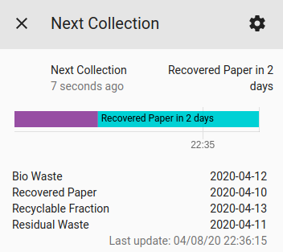
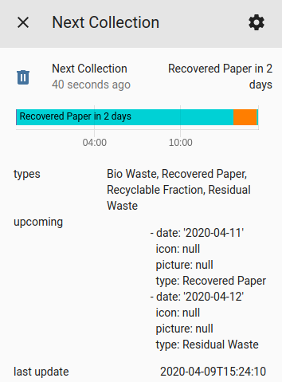
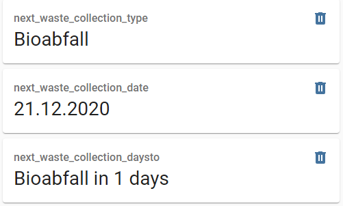

# Waste Collection Schedule

Framework to easily integrate appointment schedule services, e.g. waste collection services into Home Assistant. The entity state and details can be easily customized using templates. New sources can be added very easily.

## Showroom

Entity state is highly customizable using templates:


Details view showing the list of upcoming events:


Date format is also customizable using templates:


Alternative details view showing the list of appointment types and their next event:


[Button Cards](https://github.com/custom-cards/button-card) can be used to create individual widgets:

## Supported Service Providers

Currently the following service providers are supported:

- [Abfall.IO / AbfallPlus.de](./doc/source/abfall_io.md)
- [Abfall_Kreis_Tuebingen.de](./doc/source/abfall_kreis_tuebingen_de.md)
- [AbfallNavi.de (RegioIT.de)](./doc/source/abfallnavi_de.md)
- [Abfallwirtschaft Stuttgart](./doc/source/stuttgart_de.md)
- [AWBKoeln.de](./doc/source/awbkoeln_de.md)
- [BSR.de / Berliner Stadtreinigungsbetriebe](./doc/source/bsr_de.md)
- [Generic ICS File](./doc/source/ics.md)
- [Jumomind.de](./doc/source/jumomind_de.md)
- [Muellmax.de](./doc/source/muellmax_de.md)
- [RegioIT.de / AbfallNavi [deprecated]](./doc/source/regioit_de.md)
- [Stadtreinigung.Hamburg](./doc/source/stadtreinigung_hamburg.md)

## Configuration via configuration.yaml

The configuration consists of 2 entries in configuration.yaml.

1. Source configuration<br>
   A source is a used to retrieve the data from a web service. Multiple source can be created at the same time. Even a single source can be created multiple times (with different arguments), e.g. if you want to see the waste collection schedule for multple districts.

2. Sensor configuration<br>
   For every Source, one or more sensors can be defined to visualize the retrieved data. For each sensor, the entity state format, date format, details view and other properties can be customized.

## 1. Configure the Source(s)

```yaml
waste_collection_schedule:
  sources:
    - name: SOURCE
      args:
        SOURCE_SPECIFIC_ARGUMENTS
      customize:
        - type: TYPE
          alias: ALIAS
          show: SHOW
          icon: ICON
          picture: PICTURE
  fetch_time: FETCH_TIME
  random_fetch_time_offset: RANDOM_FETCH_TIME_OFFSET
  day_switch_time: DAY_SWITCH_TIME
  separator: SEPARATOR
```

### Configuration Variables

**sources**<br>
*(list) (required)*

List of sources. For a list of possible values per source see [Source Arguments](#source-arguments).

**fetch_time**<br>
*(time) (optional, default: ```"01:00"```)*

Time of day when to fetch new data from the source. Data will be fetched once per day.

**random_fetch_time_offset**<br>
*(int) (optional, default: ```60```)*

Random offset to the `fetch_time` in minutes. Used to distribute the fetch commands of all HO instances over a large period of time to avoid peak loads at the service providers.

**day_switch_time**<br>
*(time) (optional, default: ```"10:00"```)*

Time of day when to remove the viewed appointments for today.

How it works: If you set the ```day_switch_time``` to 10:00 the sensor will view today's appointments until 10:00. After 10:00 the sensor will remove the today's appointments and only show the upcoming events.

**separator**<br>
*(string) (optional, default: ```", "```)*

Used to join multiple appointments for either entity state or appointment-types list (n/a if value_templates are used).

### Source Arguments

**name**<br>
*(string) (required)*

Name of the source. Equates to the file name (without ```.py```) of the source. See [Supported Service Providers](#supported-service-providers) for a list of available sources.

**args**<br>
*(dict) (optional)*

Source specific arguments, e.g. city, district, street, waste type, etc. See [Supported Service Providers](#supported-service-providers) for details.

**customize**<br>
*(dict) (optional)*

Used to customize the retrieved data from a source. See [Customize Source](#customize-source) for details.

### Customize Source

Used to customize the retrieved data from a source.

**type**<br>
*(dict) (required)*

Appointment type name as is has been retrieved by the source.

**alias**<br>
*(string) (optional, default: ```None```)*

Alternative name for appointment type which shall be used instead of ```type```.

**show**<br>
*(boolean) (optional, default: ```True```)*

Show or hide the appointment with the given type.

**icon**<br>
*(string) (optional, default: ```None```)*

Alternative entity icon for appointment type which sall be used instead of the default icon.

**picture**<br>
*(string) (optional, default: ```None```)*

Optional entity picture for appointment type.

## 2. Add one or more Sensors to the Source(s)

Add the following lines to your `configuration.yaml` file:

```yaml
sensor:
  - platform: waste_collection_schedule
    source_index: SOURCE_INDEX
    name: NAME
    details_format: DETAILS_FORMAT
    count: COUNT
    leadtime: LEADTIME
    value_template: VALUE_TEMPLATE
    date_template: DATE_TEMPLATE
    types:
      - Appointment Type 1
      - Appointment Type 2
```

### Configuration Variables

**source_index**<br>
*(integer) (optional, default: ```0```)*

Reference to source. Required to assign a sensor to a specific source if there are multiple sources defined. Can be omitted if there is only one source defined. The first source has the source_index 0, the second source has 1, ...

**name**<br>
*(string) (required)*

Name of the sensor.

**details_format**<br>
*(string) (optional, default: ```"upcoming"```)*

Used to specify the format of the device-state-attribute, which are shown in the details for in the Lovelace UI.

Possible choices:

- ```upcoming``` shows a list of upcoming events.<br>
  
- ```appointment_types``` shows a list of appointment types and their next event.<br>
  
- ```generic``` provides all attributes as generic Python data types. This can be used by a specialized Lovelace card (which doesn't exist so far).<br>
  

**count**<br>
*(integer) (optional, default = infinite)*

Used to limit the number of displayed appointments in the details view of an entity by ```count```.

**leadtime**<br>
*(integer) (optional, default = infinite)*

Used to limit the number of displayed appointments in the details view of an entity. Only appointment within the next ```leadtime``` days will be shown.

**value_template**<br>
*(string) (optional)*

Template string used to render the state of an entity.

[List of available Variables](#list-of-available-variables-within-templates) within the template.

**date_template**<br>
*(string) (optional)*

Template string used to render appointment dates within the details view.

[List of available Variables](#list-of-available-variables-within-templates) within the template.

**types**<br>
*(list of strings) (optional)*

Filter for appointment types. Can be used to create a sensor for a single or dedicated list of appointment types. Can be also used to sort the list of appointments, especially for the appointment_types details view.

## List of available Variables within Templates

The following variables are available:

- ```value.date``` Appointment date, Type: datetime.date
- ```value.daysTo``` Days to appointment, 0 = today, 1 = tomorrow, ..., Type: int
- ```value.types``` Appointment types, Type: list of strings

Examples:

```yaml
# returns "Type1 and Type2 in 7 days"
'{{value.types|join(" + ")}} in {{value.daysTo}} days'

# returns "Type1, Type2 on Fri, 03/20/2020"
'{{value.types|join(", ")}} on {{value.date.strftime("%a, %m/%d/%Y")}}'
```

## Examples

### Individual sensors

Add multiple sensors if you want to have individual information:



```yaml
sensor:
  - platform: waste_collection_schedule
    name: next_waste_collection_type
    details_format: upcoming
    value_template: '{{value.types|join(", ")}}'

  - platform: waste_collection_schedule
    name: next_waste_collection_date
    details_format: upcoming
    value_template: '{{value.date.strftime("%d.%m.%Y")}}'

  - platform: waste_collection_schedule
    name: next_waste_collection_daysto
    details_format: upcoming
    value_template: '{{value.types|join(", ")}} in {{value.daysTo}} days'
```

### Button Cards

[Button Cards](https://github.com/custom-cards/button-card) can be used to create individual widgets:


```yaml
# configuration.yaml
sensor:
  - platform: waste_collection_schedule
    name: MyButtonCardSensor
    value_template: '{{value.types|join(", ")}}|{{value.daysTo}}|{{value.date.strftime("%d.%m.%Y")}}|{{value.date.strftime("%a")}}'
```

```yaml
# button-card configuration
type: 'custom:button-card'
entity: sensor.mybuttoncardsensor
layout: icon_name_state2nd
show_label: true
label: |
  [[[
    var days_to = entity.state.split("|")[1]
    if (days_to == 0)
    { return "Today" }
    else if (days_to == 1)
    { return "Tomorrow" }
    else
    { return "in " + days_to + " days" }
  ]]]
show_name: true
name: |
  [[[
    return entity.state.split("|")[0]
  ]]]
state:
  - color: red
    operator: template
    value: '[[[ return entity.state.split("|")[1] == 0 ]]]'
  - color: orange
    operator: template
    value: '[[[ return entity.state.split("|")[1] == 1 ]]]'
  - value: default
```

### Garbage Collection Card

[Garbage Collection Card](https://github.com/amaximus/garbage-collection-card) can also be used to create individual widgets:

```yaml
# configuration.yaml
sensor:
  - platform: waste_collection_schedule
    name: garbage_days
    details_format: appointment_types
    value_template: "{{ value.daysTo }}"
    types:
      - Garbage

  - platform: template
    sensors:
      garbage:
        value_template: >
          
            2
          
            {{ states('sensor.garbage_days')|int }}
          
        attribute_templates:
          next_date: "{{ state_attr('sensor.garbage_days', 'Garbage') }}"
          days: "{{ states('sensor.garbage_days')|int }}"
```

```yaml
# garbage-collection-card configuration
entity: sensor.garbage
type: 'custom:garbage-collection-card'
```

## How to add new sources

1. Create a new source in folder `custom_components/waste_collection_schedule/package/source` with the lower case url of your service provider (e.g. `abc_com.py` for `http://www.abc.com`).
2. Don't forget to add test cases (= sample data to query the service api).
3. Run `test_sources.py` script to ensure that your source works.
4. Add documentation in folder `docs/source` and add a link to your new source on `README.md`.

Example for `abc_com.py`:

```py
import datetime
from ..helpers import CollectionAppointment
from collections import OrderedDict


DESCRIPTION = "Example source for abc.com"  # Describe your source
URL = "abc.com"    # Insert url to service homepage
TEST_CASES = OrderedDict( # Insert arguments for test cases using test_sources.py script
    [("TestName", {"arg1": 100, "arg2": "street"})]
)


class Source:
    def __init__(self, arg1, arg2): # argX correspond to the args dict in the source configuration
        self._arg1 = arg1
        self._arg2 = arg2

    def fetch(self):
        entries = []

        entries.append(
            CollectionAppointment(
                datetime.datetime(2020, 4, 11),
                "Appointment Type",
            )
        )

        return entries
```

See also: [custom_components/waste_collection_schedule/package/source/example.py](./custom_components/waste_collection_schedule/package/source/example.py)
