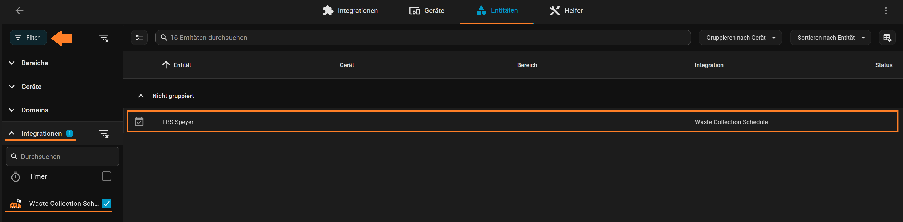
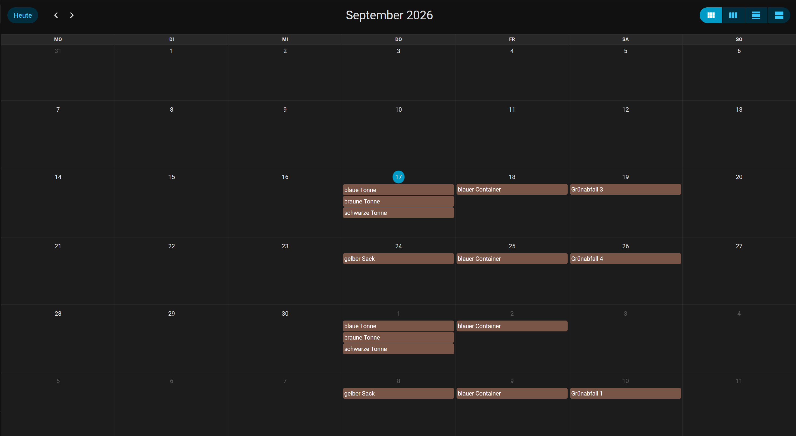
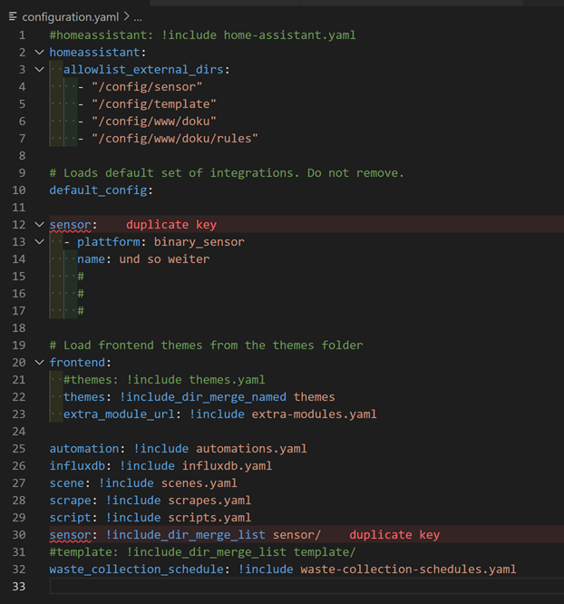
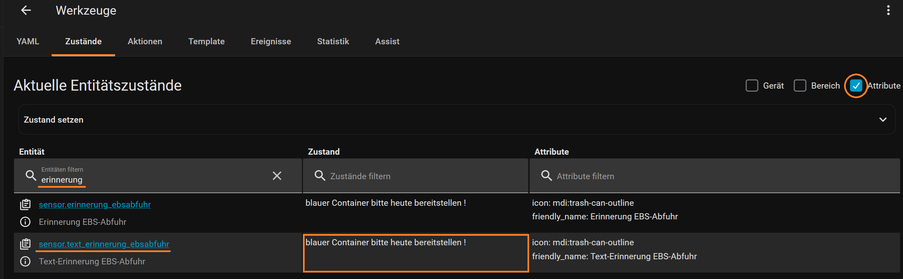

# Waste Collection Schedule

## Beschreibung

Eine HACS-Komponente für Home Assistant, welche die Müllentsorgungspläne des zuständigen Dienstleisters - falls vorhanden - abruft.</br>
Die Termine für die Abfall-Entsorgung werden entweder aus den Webseiten der entsprechenden Dienstleister gewonnen (und auch täglich aktualisiert), aus den vom Entsorger (oder Stadtverwaltung) zur Verfügung gestellten `iCal`-Dateien (`.ics`) abgeleitet, oder aus den vom Nutzer festgelegten Daten und aus den sich regelmäßig wiederholenden Datumsmustern generiert.</br>
Der integrierte lokale Kalender von Home Assistant wird automatisch mit Zeitplänen gefüllt, und es besteht ein hohes Maß an Flexibilität bei der Formatierung und Anzeige von Informationen in den sogenannten Entitätskarten oder PopUps. Das Rahmenwerk kann jederzeit problemlos um zusätzliche Anbieter von Entsorgern oder anderen Diensten erweitert werden, vorausgesetzt, dass diese auch die dafür erforderlichen Daten zur Verfügung stellen.

## Ziel

Anzeige des jeweils nächsten Termins der entsprechenden Müllentsorgung (*Bio*-, *Haus*-, *Rest*-, *Sammel*- und *Sperrmüll*) in einem ansprechenden Design.

## Voraussetzung

### Dateien

- URL der `.ics`-Abfallkalender-Datei des verantwortlichen Entsorgungsdienstes

### Kenntnisse

- `html`-, `css`- und rudimentäre `JavaScript`- und `Jinja`-Kenntnisse

  > #### Exkurs: Jinja2-Templates
  >
  > Dieser kleine Exkurs behandelt *rudimentär* die Syntax und Semantik der Template-Engine. Da die Template-Engine sehr flexibel ist, kann die Konfiguration der Anwendung hinsichtlich der Trennzeichen und des Verhaltens undefinierter Werte geringfügig vom hier vorgestellten Code abweichen.
  >
  > Ein `Jinja2`-Template ist einfach eine Textdatei. `Jinja2` kann jedes textbasierte Format (`html`, `xml`, `csv`, `LaTeX` und so weiter...) generieren. Ein `Jinja2`-Template benötigt keine bestimmte Erweiterung wie beispielsweise `.html`, `.xml` oder jede andere Erweiterung.
  >
  > Ein Template enthält Variablen und/oder Ausdrücke, die beim Rendern des Templates durch Werte ersetzt werden, und enthält ebenso Tags, welche die Logik des Templates steuern. Die Syntax hierbei ist stark von `Django` und `Python` inspiriert.
  >
  > Es gibt verschiedene Arten von Trennzeichen. Die standardmäßigen `Jinja2`-Trennzeichen sind wie folgt konfiguriert:
  >
  > - `` → für (limitierte Python-) Anweisungen
  > - `{{ ... }}` → für Ausdrücke, die in der Template-Ausgabe angezeigt werden sollen
  > - `{# ... #}` → für Kommentare, die nicht in der Template-Ausgabe enthalten sind
  >
  > Zeilenanweisungen und Kommentare sind zwar ebenfalls möglich, verfügen jedoch nicht über standardmäßige Präfix-Zeichen und können nur dann verwendet werden, wenn dies im System (HA) auch derart festgelegt worden ist.
  >
  > ***Template-Variablen*** werden durch das an das Template übergebene *Dictionary* definiert. Man kann mit den Variablen in Templates experimentieren, vorausgesetzt, sie werden von der Anwendung auch übergeben. Variablen können Attribute oder Elemente enthalten, auf die man ebenfalls zugreifen kann.
  > Welche Attribute eine Variable hat, hängt stark von der Anwendung ab, die diese Variable bereitstellen soll.
  >
  > Man kann anstelle der *Standard*-Python-`__getitem__`-'subscript'-Syntax [ ] auch einen Punkt (.) verwenden, um Zugriff auf die Attribute einer Variablen zu bekommen.
  > Die folgenden Zeilen bewirken demnach dasselbe :
  >
  > ```yaml
  > {{ foo.bar }}  
  > {{ foo['bar'] }}
  > ```
  >
  > **Wichtig**:
  > die äußeren doppelten geschweiften Klammern `{{` sind nicht Teil der Variablen, sondern der *print-Anweisung*. Wenn man auf Variablen innerhalb von Tags zugreifen möchte, dann darf man diese nicht in geschweifte Klammern setzen.
  > Ein Minus-Zeichen (`-`) trimmt das entsprechende Objekt davor (`{{-`, ``).
  >
  > Wenn eine Variable oder ein Attribut nicht existieren, dann erhält man als Resultat davon einen ***undefinierten*** Wert zurück. Was man mit dieser Art von Wert tun kann, hängt gänzlich von der Konfiguration der jeweiligen Anwendung ab :
  > das Standard-Verhalten besteht darin, dass nach der Auswertung beim Drucken oder Iterieren einer leeren Zeichenfolge der Vorgang sofort abgebrochen und eine Fehlermeldung generiert wird.

### Integrationen

- HACS
- Waste Collection Schedule

### Frontend

- Lovelace Card Mod (optional, empfehlenswert)
- Custom Button Card (optional)
- Lovelace Layout Card (optional)
- Browser Mod 2 (optional)

## Installation

Zur Einrichtung des Abfallkalenders gibt es zwei Arten - ***Gui*** und ***Yaml*** -, und hierbei wiederum jeweils mehrere Möglichkeiten. In dieser Anleitung wird die **Yaml-Variante** mit einer `.ics`-Datei beschrieben, welche als Download(link) vom entsprechenden Entsorgungsdienst (oder der Stadtverwaltung) zur Verfügung gestellt wird, und dadurch automatisch täglich aktualisiert werden kann. Um *Waste Collection Schedule* zu installieren und anschließend zu konfigurieren, ist Folgendes zu tun :

1. HA → HACS → in die Suchmaske `was` eintragen, und den Eintrag `Waste Collection Schedule` auswählen → herunterladen → Version auswählen, hier: **3.0.0** → Installationsverzeichnis: `/config/custom_components/waste_collection_schedule` → herunterladen
2. HA → Werkzeuge → gegebenenfalls die Registerkarte `YAML` öffnen → Konfiguration prüfen → OK ? → neu starten
3. HA → Studio Code Server → `configuration.yaml` → nachfolgende Codezeile an das Ende einfügen :
  
   ```yaml
   waste_collection_schedule: !include waste-collection-schedules.yaml
   ```

4. Im `config/`-Verzeichnis eine neue Datei namens `waste-collection-schedules.yaml` anlegen (und öffnen), und nun den nachfolgenden Code eintragen, um den Kalender zu erstellen, wobei die Eingaben beziehungsweise Werte jeweils dem eigenen Szenario entsprechend angepasst werden müssen.
   Benötigt wird hierzu nun der genaue Link zur `.ics`-Datei des Abfallkalenders des jeweiligen Dienstanbieters. Den Wert des Parameters Abfuhrkalender und Jahr, von `Speyer2026` in `Speyer`**`{%Y}`** beziehungsweise von `2026` in **`{%Y}`** ändern, wodurch dieser Wert bei jedem Download automatisch auf den Wert des aktuellen Datums (Jahr) angepasst wird, so dass ein manuelles Downloaden (besonders am Jahresende) entfällt:
  
   ```yaml
   sources: # enthält Infos über beziehungsweise für den Kalender
     - name: ics # "ics", falls der Dienstanbieter von wcs nicht unterstützt wird
       args:
         url: https://www.stadtwerke-speyer.de/speyerGips/Gips?SessionMandant=Speyer&Anwendung=Abfuhrkalender&Methode=TermineAnzeigenICS&Mandant=Speyer&Abfuhrkalender=Speyer{%Y}&Bezirk_ID=17&Jahr={%Y}
       calendar_title: "EBS Speyer" # der Name des Kalenders
       day_offset: 0 # 0; day_offset in Tagen, der zum Abholdatum addiert werden soll (darf *negativ* sein)
   fetch_time: "01:16" # zu welcher Zeit soll der tägliche (Update-)Download stattfinden
   random_fetch_time_offset: 15 # zufällige Startzeit innerhalb ..._offset Minuten (+/-) von fetch-time
   day_switch_time: "23:59" # Zeitpunkt (HH:MM), ab welchem der aktuelle Eintrag verworfen und zum nächsten Eintrag übergegangen wird
   separator: "," # trennt bei Textausgaben die Einträge mittels Separator voneinander
   ```

5. Die Datei speichern → HA → Werkzeuge → gegebenenfalls die Registerkarte `YAML` öffnen → Konfiguration prüfen → OK ? → neu starten
6. Überprüfung:
   HA → Einstellungen → Geräte & Dienste → auf den Menüeintrag `Entitäten` klicken, und nach *Integrationen → Waste Collection Schedule* filtern. Es sollte nun der Kalender aufgelistet sein :
   
   *Abbildung: Liste der Entitäten, gefiltert nach der Integration Waste Collection Schedule*
   </br>
  
   **Und** / **oder** :
  
   HA → Werkzeuge → Menüeintrag *Zustände* → Entitäten nach dem Namen des Kalenders (hier: ebs) filtern  
   
   *Abbildung: Liste der Zustände, gefiltert nach dem Kalendernamen (hier: ebs)*
   </br>
  
   **Und** / **oder** :  
   HA → Kalender  
   
   *Abbildung: Abfuhr-Termine der verschiedenen Abfall-Arten im Kalender des entsprechenden Dienstleisters*
  
   ### Angelegte Dateien und Verzeichnisse
  
   - config/custom_components/waste_collection_schedule/
   - translations/
   - waste_collection_schedule/
   - \_\_init\_\_.py
   - calendar.py
   - config_flow.py
   - const.py
   - icons.json
   - init_ui.py
   - init_yaml.py
   - manifest.json
   - sonsor.py
   - service.py
   - services.yaml
   - sources.json
   - waste_collection_api.py
   - wcs_coordinator.py
  
   Somit war die Installation bislang erfolgreich. Herzlichen Glückwunsch !
7. In Studio Code Server im `/config`-Verzeichnis die Ordner `sensoren` und `templates` anlegen.
8. In Studio Code Server in der Datei `configuration.yaml` jetzt zuerst die nachfolgenden Einträge an das Ende hinzufügen :
  
   ```yaml
   sensor: !include_dir_merge_list sensoren/
   template: !include_dir_merge_list templates/
   ```
  
   </br>
   *Abbildung: duplikate Key in der configuration.yaml*
   </br>
  
   Sollte es jetzt zu einer Fehleranzeige im Code durch Studio Code Server kommen, derart, dass einer oder gar beide Einträge als `duplikate Key` (doppelter Eintrag) markiert werden, dann liegt es daran, dass bereits einer der beiden Domänen `sensor:` und/oder `template:` in der Datei vorhanden sind. Ist dies nun der Fall, dann ist Folgendes zu tun, ansonsten mit Punkt 9 fortfahren :
   </br>
  
   Angenommen, der Inhalt der Domäne `sensor:` in der `configuration.yaml` bestünde aktuell aus den nachfolgenden Einträgen :
  
   ```yaml
   sensor:
   - platform: feedparser
     name: CHIEFS News
   ...
   
   - platform: feedparser
     name: FORTUNA News
   ...
   
   - platform: template
     sensors:
       chiefs_news_attributes_0:
         friendly_name: "Chiefs News Content 0"
         value_template: >
           {{ states.sensor.chiefs_news.attributes.entries[0].title }}
   
   - platform: template
     sensors:
       chiefs_news_attributes_1:
         friendly_name: "Chiefs News Content 1"
         value_template: >
           {{ states.sensor.chiefs_news.attributes.entries[1].title }}
   
   - platform: template
     sensors:
       fortuna_news_attributes_0:
         friendly_name: "Fortuna News Content 0"
         value_template: >
           {{ states.sensor.fortuna_news.attributes.entries[0].title }}
   ```
  
   ... dann würden (zwei) unterschiedliche Werte des Parameters `name` der `platform`-Einträge `feedparser` zugeordnet - hier sind dies: `CHIEFS News` und `FORTUNA News`. Für jeden dieser Einträge wird jeweils im Verzeichnis `/config/sensoren/` eine separate `.yaml`-Datei angelegt :  
   `feedparser-sensor--chiefs.yaml` und  
   `feedparser-sensor--fortuna.yaml`.
   </br>
  
   Die Verzeichnisstruktur würde sich diesbezüglich nun wie folgt darstellen :
  
   ```yaml
   ˅ config
     > blueprints
     > custom_components
     > esphome
     ...
   
     ˅ sensoren   
         feedparser-sensor--chiefs.yaml
         feedparser-sensor--fortuna.yaml
     > templates
     ...
     configuration.yaml
     ...
     waste-collection-schedules.yaml
   ```
  
   Die Inhalte der Dateien wären demnach :
  
   *feedparser-sensor--chiefs.yaml* :
  
   ```yaml
   - platform: feedparser
     name: CHIEFS News
     ...
   
   - platform: template
     sensors:
       chiefs_news_attributes_0:
         friendly_name: "Chiefs News Content 0"
         value_template: >
           {{ states.sensor.chiefs_news.attributes.entries[0].title }}
   
   - platform: template
     sensors:
       chiefs_news_attributes_1:
         friendly_name: "Chiefs News Content 1"
         value_template: >
           {{ states.sensor.chiefs_news.attributes.entries[1].title }}
   ```
  
   feedparser-sensor--fortuna.yaml :
  
   ```yaml
   - platform: feedparser
     name: FORTUNA News
     ...
   
   - platform: template
     sensors:
       fortuna_news_attributes_0:
         friendly_name: "Fortuna News Content 0"
         value_template: >
           {{ states.sensor.fortuna_news.attributes.entries[0].title }}
   ```
  
   Letztendlich wird in der Datei `configuration.yaml` alles **innerhalb** der Domäne `sensor:` dem Inhalt nach in entsprechende externe Dateien ausgelagert (cut & paste) und der Eintrag `sensor:` durch `sensor: !include_dir_merge_list sensoren/` ersetzt. Analog dazu nun die Domäne `template:` entsprechend in externe Dateien auslagern und dementsprechend anpassen (`template: !include_dir_merge_list templates/`).
  
   **Achtung:**
   Studio Code Server zeigt hierbei (`sensor: !include_dir_merge_list sensoren/`) den Fehler ***patternWarning*** an - warum auch immer. Der Code ist richtig und funktioniert, keine Sorge...
   </br>
10. Den folgenden Codeblock an den Anfang - unterhalb der Domäne `logger:` - der `configuration.yaml` platzieren und anschließend speichern :
  
   ```yaml
   homeassistant:
     allowlist_external_dirs:
       - "/config/sensoren"
       - "/config/templates"
   ```
  
   Meine `configuration.yaml` sieht beispielsweise wie folgt aus :
  
   ```yaml
   logger:
     default: warning
     logs:
       custom_components.feedparser: debug
   
   homeassistant:
     allowlist_external_dirs:
       - "/config/sensoren"
       - "/config/templates"
   
   # Loads default set of integrations. Do not remove.
   default_config:
   
   # Load frontend themes from the themes folder
   frontend:
     themes: !include_dir_merge_named themes
     extra_module_url: !include extra-modules.yaml
   
   # Outsourced
   automation: !include automations.yaml
   influxdb: !include influxdb.yaml
   scene: !include scenes.yaml
   scrape: !include scrapes.yaml
   script: !include scripts.yaml
   sensor: !include_dir_merge_list sensoren/
   template: !include_dir_merge_list templates/
   waste_collection_schedule: !include waste-collection-schedules.yaml
   ```

11. HA → Werkzeuge → Konfiguration prüfen → OK ? → neu starten

## Konfiguration

### Sensoren

Alle Sensoren werden nach demselben Code-Muster konstruiert, somit muss lediglich der jeweilge Inhalt kopiert, und anschließend die entsprechenden Werte der Parameter `name` und `types` angepasst werden. Deswegen werden hier nur zwei Sensoren als Beispiel herangezogen: der Haupt-Sensor (nächste EBS-Abfuhr) und die Abfallart-Sensoren (Papiertonne, etc).

**Hinweis**:</br>
Die Namen der `.yaml`-Dateien dürfen sowohl die Umlaute `ä`, `ö` und `ü`, als auch `Leerzeichen` enthalten !Ich empfehle hingegen: `a`, `o`, `u` und als Trennung ein oder mehrere `Minus`-Zeichen (`-`, `--` , `---`).

1. Studio Code Server öffnen → im Verzeichnis `/config/sensoren` die Datei `wcs-sensor--nachste-ebs-abfuhr.yaml` (des Hauptsensors) anlegen, und die nachfolgenden Codezeilen in die leere Datei eintragen → diese Änderungen anschließend speichern :
  
   ```yaml
   - platform: waste_collection_schedule
     name: "nächste EBS-Abfuhr"
     value_template: >
       {{value.types|join(", ")}}
        heute
        morgen
        in {{value.daysTo}} Tagen
       
   ```

2. Die `.ics`-Kalenderdatei, welche bekanntermaßen vom Entsorgungsbetrieb (oder der Stadtverwaltung) als Download(-Link) angeboten wird, nun auch auf den lokalen PC hochladen. Diese Datei wird hier nur für den nachfolgenden Schritt benötigt, und kann danach sofort wieder gelöscht werden.</br>
Ist die `.ics`-Datei nun auf den PC hochgeladen worden, dann diese mittels eines gewöhnlichen Texteditors (beispielsweise *Notepad*) öffnen, um danach deren Inhalt einsehen zu können. Die Werte, die hier unter dem Parameter-Namen `SUMMARY` gelistet werden, sind diejenigen, welche den Sensoren-Namen bilden - **nicht** den Namen der `.yaml`-Sensor-Datei ! - und zwar **identisch**, Zeichen für (Leer-)Zeichen, gegebenenfalls auch mit Umlauten !
3. Den Cursor nun an den Anfang der ersten Zeile setzen → `STRG + F` öffnet die Suchfunktion innerhalb der Datei → `summary` in die Suchmaske eintragen, um das erste Vorkommen anzuzeigen. Den **Wert** dieses Parameters notieren → nun nach dem nächsten Vorkommen suchen → dessen **Wert** notieren..., solange, bis alle Werte notiert sind. Hierbei gilt zu beachten, dass keine Duplikate notiert werden.</br>
Letztendlich sind dies bei mir :
  
   | Mülltyp      | Aliasname      |Sensor-Dateiname                   |
   |:-------------|:---------------|:----------------------------------|
   |Biotonne      | braune Tonne   | wcs-sensor--braune-tonne.yaml     |
   |Gelber Sack   | gelber Sack    | wcs-sensor--gelber-sack.yaml      |
   |Grünabfall 1  | Grünabfall 1   | wcs-sensor--grunabfall-1.yaml     |
   |Grünabfall 2  | Grünabfall 2   | wcs-sensor--grunabfall-2.yaml     |
   |Grünabfall 3  | Grünabfall 3   | wcs-sensor--grunabfall-3.yaml     |
   |Grünabfall 4  | Grünabfall 4   | wcs-sensor--grunabfall-4.yaml     |
   |Papiertonne   | blaue Tonne    | wcs-sensor--blaue-tonne.yaml      |
   |Papier Gewerbe|blauer Container|wcs-sensor--blauer-container.yaml  |
   |Resttonne     |schwarze Tonne  | wcs-sensor--schwarze-tonne.yaml   |
   |Sonderabfall A|Sonderabfall 1  |wcs-sensor--sonderabfall-1.yaml    |
   |Sonderabfall B|Sonderabfall 2  |wcs-sensor--sonderabfall-2.yaml    |
   |Tannenbaum    |Tannenbaum      |wcs-sensor--tannenbaum.yaml        |
  
   Die Namen der `.yaml`-Dateien dürfen sowohl die Umlaute `ä`, `ö` und `ü`, als auch `Leerzeichen` enthalten !
  
   Wer dies nicht mag, sollte auch auf den Unterstrich (`_`) als Trennzeichen verzichten, und stattdessen das Minuszeichen (`-`) als Trennzeichen verwenden.</br>
   Kleinbuchstaben verwenden!
  
   Die Datei `wcs sensor gelber sack.yaml` sollte demnach nun wie folgt benannt werden :
   `wcs-sensor--gelber-sack.yaml`.
  
   Momentan hat die Datei `waste-collection-schedules.yaml` den nachfolgenden Inhalt :
  
   ```yaml
   sources: # enthält Infos über beziehungsweise für den Kalender
    - name: ics # "ics", falls der Dienstanbieter von wcs nicht unterstützt wird
      args:
        url: https://www.stadtwerke-speyer.de/speyerGips/Gips?SessionMandant=Speyer&Anwendung=Abfuhrkalender&Methode=TermineAnzeigenICS&Mandant=Speyer&Abfuhrkalender=Speyer{%Y}&Bezirk_ID=17&Jahr={%Y}
      calendar_title: "EBS Speyer" # der Name des Kalenders
      day_offset: 0 # 0; day_offset in Tagen, der zum Abholdatum addiert werden soll (darf *negativ* sein)
   fetch_time: "01:16" # zu welcher Zeit soll der tägliche (Update-)Download stattfinden
   random_fetch_time_offset: 15 # zufällige Startzeit innerhalb ..._offset Minuten (+/-) von fetch-time
   day_switch_time: "23:59" # Zeitpunkt (HH:MM), ab welchem der aktuelle Eintrag verworfen und zum nächsten Eintrag übergegangen wird
   separator: "," # trennt bei Textausgaben die Einträge mittels separator voneinander
   ```
  
   Bevor die Sensor-Dateien angelegt und mit Code gefüllt werden, muss zunächst die Datei `waste-collection-schedules.yaml` angepasst werden :
4. Zuerst wird der Parameter `source:` um das Attribut `customize:` - eine Liste - erweitert, welche mittels nachfolgender Attribute konfiguriert werden kann:</br>
`type:`, `alias:`, `show:`, `icon:`, `picture:`, `use_dedicated_calendar:` und `dedicated_calendar_title:`.
  
   Dazu nun zuerst unterhalb - ***unterhalb***, **nicht** ***Attribut von*** (!) - des Attributs `arg:` das Attribut `customize:` einfügen, und danach dessen Parameter und deren Werte. Die `waste-collection-schedules.yaml` sollte nun nach dem ersten Abfallart- beziehungsweise Mülltyp-Eintrag nachfolgenden Inhalt aufweisen :
  
   ```yaml
   sources: # enthält Infos über beziehungsweise für den Kalender
   - name: ics # "ics", falls der Dienstanbieter von wcs nicht unterstützt wird
     args:
       url: https://www.stadtwerke-speyer.de/speyerGips/Gips?SessionMandant=Speyer&Anwendung=Abfuhrkalender&Methode=TermineAnzeigenICS&Mandant=Speyer&Abfuhrkalender=Speyer{%Y}&Bezirk_ID=17&Jahr={%Y}
     customize:
       type: "Biotonne" # Name der Abfallart, so wie er im Kalender aufgeführt ist
       alias: "braune Tonne" # neuer Name
       show: True # diese Abfallart anzeigen (True)
       icon: mdi:trash-can-outline # icon aus der mdi-Sammlung
       #picture: \# "Pfad zum Bild, das verwendet werden soll"
       use_dedicated_calendar: False # separaten Kalender, speziell für diese Abfallart, anlegen?
       #dedicated_calendar_title: # "Titel des speziell für diese Abfallart angelegten Kalenders"
     calendar_title: "EBS Speyer"
     day_offset: 0
   fetch_time: "01:16"
   random_fetch_time_offset: 15
   day_switch_time: "15:00"
   separator: ","
   ```
  
   Sogenannte `Jinja2`-Templates kommen nun zum Einsatz. Es können 2 Template-Typen verwendet werden:
  
   - zum einen ein Template zum verarbeiten der Kalender-Werte - auch der Datumswerte - (→Werte- oder Value-Template),
   - zum anderen ein Template zum Verarbeiten der Datumswerte (→Datum- oder Date-Template).
  
   Wie diese angefertigt und eingesetzt werden, ist nachfolgend beschrieben :
  
   #### Value-Template
  
   | Ausgabe                        | Code                                                                                                              |
   | ------------------------------ | ----------------------------------------------------------------------------------------------------------------- |
   | " "                            | " "                                                                                                               |
   | "in [Zahl] Tagen"              | "in {{value.daysTo}} Tagen"                                                                                       |
   | "[Müllart] in [Zahl] Tagen"    | "{{value.types\| join(', ')}} in {{value.daysTo}} Tagen"                                                          |
   | "[Zahl]"                       | "{{value.daysTo}}"                                                                                                |
   | "in [Zahl] Tagen/Morgen/Heute" | "heutemorgenin {{value.daysTo}} Tagen" |
   | "[Wochentag], den dd.mm.yyyy"  | "{{value.date.strftime('%a')}}, den {{value.date.strftime('%d.%m.%Y')}}"                                          |
   | "[Wochentag], yyyy-mm-dd"      | "{{value.date.strftime('%a')}}, {{value.date.strftime('%Y-%m-%d')}}"                                              |
   | "nächste BFS-Abfuhr"           | "{{value.types\|join(', ')}}"  {# Beispiel: Biotonne in 5 Tagen #}                                                |
  
   #### Date-Template
  
   | Ausgabe           | Code                                      |
   | :---------------- | :---------------------------------------- |
   | ""                | ""                                        |
   | "20.03.2020"      | "{{value.date.strftime('%d.%m.%Y')}}"     |
   | "Fri, 20.03.2020" | "{{value.date.strftime('%a, %d.%m.%Y')}}" |
   | "03/20/2020"      | "{{value.date.strftime('%m/%d/%Y')}}"     |
   | "Fri, 03/20/2020" | "{{value.date.strftime('%a, %m/%d/%Y')}}" |
   | "2020-03-20"      | "{{value.date.strftime('%Y-%m-%d')}}"     |
   | "Fri, 2020-03-20" | "{{value.date.strftime('%a, %Y-%m-%d')}}" |
  
5. Falls die `.yaml`-Sensor-Dateien (`wcs-sensor--braune-tonne.yaml`, etc.) der jeweiligen Abfall-Arten noch nicht im Ordner `/config/sensoren` erstellt worden sind, dann ist es nun an der Zeit, dies nachzuholen. Zuerst jedoch nur eine der soeben erstellten Dateien mit Inhalt füllen, und zwar diejenige, welche in der Datei `waste-collection-schedules.yaml` innerhalb des neu angelegten Attributs `customize:` soeben aufgelistet beziehungsweise eingetragen worden ist.</br>
Der nachfolgende Code ist beispielhaft für eine Abfallart-Sensordatei - hier ist es die Datei `wcs-sensor--braune-tonne.yaml` - und kann als Muster für alle weiteren Abfallart-Sensordateien verwendet werden, wobei dann jeweils nur einige Parameter-Werte angepasst werden müssen :
  
   ```yaml
   - platform: waste_collection_schedule
     source_index: 0 # Quelle: ics
     name: "braune Tonne" # alias, wenn der Wert gesetzt worden ist
     details_format: upcoming # gültig sind upcoming, appointment_types, generic, hidden
     count: 1 # die Anzeige der nächsten count-Sammlungen im HA-Popup
     lead_time: 7 # die Anzeige von Abholungen, die innerhalb der nächsten leadtime-Tage stattfinden
     value_template: >
       "{{ value.daysTo }}" {# Anzahl der Tage bis zur Abholung dieser Abfallart #}
     #date_template: {{ value.date.strftime('%A, %d.%m.%Y') }}
     add_days_to: 0 # addiert die add_days_to-Anzahl der Tage zu den Tagen bis zur nächsten Sammlung
     event_index: 0 # nächste Abholung; 1: zweite (übernächste) Abholung; 2: dritte Abholung, ...
   
     types:
       - braune Tonne # Abfallarten, die unter diesem Sensor-Namen geführt werden sollen
   ```
  
   #### Erläuterung
  
   - `source_index:`</br>**Konstante:** `SOURCE_INDEX`</br>**Standard**: 0</br>**Beschreibung**: wird verwendet, um einen Sensor einer bestimmten Quelle zuzuordnen. Dies ist nur dann erforderlich, wenn mehrere Quellen definiert sind. Die erste definierte Quelle ist `source_index 0`, die zweite `source_index 1` usw. Wenn man einen Sensor haben möchte, der die Daten aus mehreren Quellen kombiniert, dann muss einfach eine Liste der Quellen hinzugefügt werden. Dieser Parameter ist bei Verwendung der GUI-Konfiguration nicht verfügbar, da die Sensoren direkt zu den Quellen hinzugefügt werden.
   - `name`:</br>**Konstante**: `NAME`</br>**Standard**: der von der Quelle zugeordnete Namen</br>**Beschreibung**: Name des Sensors
   - `details_format`:</br>**Konstante**: `DETAILS_FORMAT`</br>**Standard**: upcoming</br>**Beschreibung**: gibt das Format an, welches zum Anzeigen von Informationen im HA-Popup-Fenster verwendet wird. Gültige Werte sind: `upcoming`, `appointment_types`, `generic` und `hidden`
   - `count`:</br>**Konstante**: `COUNT`</br>**Standard**: 1</br>**Beschreibung**: die Anzeige der nächsten [Zahl]-Sammlungen im HA-Popup
   - `leadtime`:</br>**Konstante**: `LEADTIME`</br>**Standard**: 1</br>**Beschreibung**: die Anzeige von Abholungen, die innerhalb der nächsten `leadtime`-Tage stattfinden
   - `value_template`:</br>**Konstante**: `VALUE_TEMPLATE`</br>**Beschreibung**: Template, um die Statusinformationen einer Entität zu formatieren.
   - `date_template`:</br>**Konstante**: `DATE_TEMPLATE`</br>**Beschreibung**: Template, um die Datum-Daten einer Entität im HA-Popup zu formatieren.
   - `add_days_to`:</br>**Konstante**: `ADD_DAYS_TO`</br>**Standard**: 0</br>**Beschreibung**: die `add_day_to`-Anzahl der Tage bis zur nächsten Sammlung
   - `event_index`:</br>**Konstante**: `EVENT_INDEX`</br>**Standard**: 0</br>**Beschreibung**: um einem Sensor einen bestimmten Abholdatums-Index zuzuordnen. Das nächste Abholdatum hat den `event_index`-Wert 0. Nützlich, wenn man dedizierte Sensoren für die nächste Abholung, zweite Abholung, dritte Abholung, usw. haben möchte.
   - `types`:</br>**Konstante**: `TYPES`</br>**Beschreibung**: Filtern nach Abfallarten. Der Sensor zeigt nur Sammlungen an, die dieser Abfallart entsprechen. Man muss den Aliasnamen einsetzen, wenn man für den betreffenden Sensor unter dem Attribut `customize` (`waste-collection-schedule.yaml`) den Parameter `Alias` verwendet hat.
6. HA → Werkzeuge → Konfiguration prüfen → OK ? → neu starten
7. Zum Überprüfen kann außer den bereits erwähnten Möglichkeiten nun auch das Standard-Dashboard *Übersicht* verwendet werden. Dort sollte der soeben angelegte Sensor `braune Tonne` unter dem Bereich `Sensor` aufgelistet sein, samt seines Wertes. Wird jetzt in diesem Dashboard auf diesen Abfallart-Sensor geklickt, dann erscheint das entsprechende HA-PopUp mit weiteren Informationen über den betreffenden Sensor; unter anderem kann man dort die `Entitäts-ID` des betreffenden Sensors einsehen, kopieren oder aber auch ändern...
8. Die restlichen Sensor-`.yaml`-Dateien im Ordner `/config/sensoren` mit dem entsprechenden Code füllen.
9. Zur zwischenzeitlichen Überprüfung:
   HA → Werkzeuge → Konfiguration prüfen → OK ? → neu starten → HA → Übersicht → unter dem Bereich Sensor sollten nun alle neu angelegten Sensoren zu finden sein. Herzlichen Glückwunsch !
10. Man kann auch mehrere Abfallart-Sensoren zusammenfassen. Beispielsweise könnte man die Abfallarten `Grünabfall 1`, `Grünabfall 2`, `Grünabfall 3`, `Grünabfall 4` und `Tannenbaum` zu einem einzigen Sensor zusammenfassen. Dazu im Ordner `/config/sensoren` eine neue Datei namens `wcs-sensor--grunabfall.yaml` anlegen, und mit nachfolgendem Code-Block füllen :
  
    ```yaml
    - platform: waste_collection_schedule
      source_index: 0
      name: "Grünabfall"
      details_format: upcoming
      count: 1
      leadtime: 7
      value_template: "{{value.daysTo}}"
    
      #date_template: "{{value.date.strftime('%A, %d.%m.%Y')}}"
      add_days_to: 0
      event_index: 0
      types:
       - Grünabfall 1
       - Grünabfall 2
       - Grünabfall 3
       - Grünabfall 4
       - Tannenbaum
    ```

11. Nun wird ein weiterer Sensor angelegt, welcher sowohl die Abfallart, als auch die Anzahl der Tage anzeigt, bis die nächste Müll-Abfuhr erfolgt. Man kann auch 'nur' die Abfallart und das entsprechende Datum des nächsten Abfuhrtermins anzeigen lassen. Dazu jetzt zunächst im Verzeichnis `/config/sensoren` eine neue Datei namens `wcs-sensor--nachste-ebs-abfuhr.yaml` anlegen, und nachfolgenden Code eintragen :
  
    ```yaml
    - platform: waste_collection_schedule
      name: "nächste EBS-Abfuhr"
      value_template: >
        {{value.types|join(\", \")}}
         heute
         morgen
         in {{value.daysTo}} Tagen
        
    ```

12. HA → Werkzeuge → Konfiguration prüfen → OK ? → neu starten → HA → Übersicht → unterhalb des Bereichs `Sensor` sollten nun alle neu angelegten Sensoren zu finden sein. Herzlichen Glückwunsch !

### Templates

Einige Template-Schnipsel wurden bereits jeweils bei den Sensor-`.yaml`-Dateien verwendet. Diese dienten dazu, die Anzeige des jeweiligen Sensors oder Sensorgruppe im Dashboard zu steuern. Dasjenige Template, welches letztendlich die Textausgabe des Popups (beispielsweise: *Heute müssen folgende Abfälle bereitgestellt werden: ...*) steuert, besteht weitgehend aus `Jinja2`-Code, und kann - mit wenigen Einschränkungen - nun nach persönlichen Vorlieben erstellt werden.</br>
Wer detaillierte Informationen (mit Code-Beispielen) über das Programmieren mit der `Jinja2`-Engine bekommen möchte, wird vor allem bei [Template Designer Documentation](https://jinja.palletsprojects.com/en/latest/templates/) fündig werden.
Um ein Template zur Steuerung der Textausgabe zu erstellen - Ziel ist es, dass bereits am **Vortag** des Abfuhr-Termins eine Nachricht erscheint, mit der Information, welche Abfallart zur Abfuhr bereitgestellt werden muss.</br>
Um dies zu erreichen, ist nun Folgendes zu tun :

1. HA → Studio Code Server → die Datei `wcs-template--erinnerung-ebs-abfuhr.yaml` im Verzeichnis `/config/sensoren` anlegen, und vorab den nachfolgenden Code-Block einfügen :
  
   ```yaml
   - name: Erinnerung EBS-Abfuhr
     unique_id: erinnerung_ebsabfuhr
     icon: mdi:trash-can-outline
     state: >
       # hier wird später der persönliche Template-Code eingefügt - die Einrückung(en) dabei beachten !
   ```

2. HA → Werkzeuge → in der Menüleiste den Eintrag `Template` auswählen → in den dortigen Editor nun den individuellen Code eingeben. Nachfolgend jetzt ein Beispiel-Code, anhand dessen man üben kann, um letztendlich den eigenen Code anlegen zu können.
  
   **Tipp:**</br>
   die exakte `Entitäten-ID` des jeweiligen Sensors kann wie folgt ermittelt werden:</br>
   Im Standard-Dashboard *Überblick* auf den betreffenden Sensor klicken, woraufhin das Popup des betreffenden Sensors erscheint. In diesem auf das Zahnrad-Symbol klicken, woraufhin sich der Konfigurations-Dialog des betreffenden Sensors öffnet. Dort kann die `Entitäts-ID` des Sensors festgelegt und auch kopiert werden (durch Klick auf das Dokumenten-Symbol am Rand rechts außen der Sektion *Entitäts-ID*).
  
    ```yaml
    {% set StatusSensoren = {
      "braune Tonne": states.sensor.braune_tonne.state,
      "blaue Tonne": states.sensor.blaue_tonne.state,
      "gelber Sack": states.sensor.gelber_sack.state,
      "schwarze Tonne": states.sensor.schwarze_tonne.state,
      "Grünabfall 1": states.sensor.grunabfall_1.state,
      "Grünabfall 2": states.sensor.grunabfall_2.state,
      "Grünabfall 3": states.sensor.grunabfall_3.state,
      "Grünabfall 4": states.sensor.grunabfall_4.state,
      "Sondermüll 1": states.sensor.sonderabfall_1.state,
      "Sondermüll 2": states.sensor.sonderabfall_2.state,
      "blauer Container": states.sensor.blauer_container.state,
      "Tannenbaum": states.sensor.tannenbaum.state,
      }
    %}
    
    ```
  
   Aus diesen beiden Zuweisungen können jetzt die unterschiedlichsten Textausgaben erzeugt werden :

   Bei der ersten Zuweisung wird der Variablen `StatusSensoren` ein sogenanntes *Dictionary* zugewiesen. Es besteht aus `"Schlüssel":Wert`-Paaren, welche mittels Kommata (`,`) voneinander getrennt aufgelistet werden, wobei das letzte `"Schlüssel":Wert`-Paar ebenfalls ein Kommata am Ende als Trennung beinhalten darf. Die gesamten `"Schlüssel":Wert`-Paare sind umfasst von jeweils einer geschweiften Klammer, die den Anfang `{` beziehungsweise das Ende `}` eines *Dictionaries* repräsentieren. Man kann sowohl auf den Schlüssel, als auch auf den Wert des Schlüssels eines `"Schlüssel":Wert`-Paares des *Dictionaries* zugreifen.</br>  
   Bei der zweiten Zuweisung wird ein sogenannter *Namensraum* gebildet. Ein *Namensraum* ist eine Sammlung aktuell definierter symbolischer Namen zusammen mit Informationen über dasjenige Objekt, auf welches jeder (symbolische) Name verweist. Man kann sich einen *Namensraum* auch als einen Typ *Dictionary* vorstellen, in dem die "Schlüssel" die (symbolischen) Objektnamen und die Werte die Objekte selbst sind. Jedes `"Schlüssel":Wert`-Paar ordnet demnach seinem entsprechenden Objekt einen Namen zu.</br>
Im Beispiel-Code wird der Variablen `SensorDeadLine` der *Namensraum* `key` als leere Liste (`[]`) zugewiesen, auf diese nun mittels `SensorDeadLine.key` zugegriffen werden kann. Es ist meines Wissens nach momentan die einzige Möglichkeit, um in Home Assistant (HA) dynamische Listen in Templates zu erzeugen.</br>
Dieser *Namensraum* ist lokal und somit auch nur innerhalb dieses Templates gültig. Er bleibt solange bestehen, bis das Template beendet wird.</br>
In den nachfolgenden Beispielen sind nun einige mögliche Textausgabe-Muster aufgeführt. Die Textausgabe wird somit nur durch die individuelle Einfallslosigkeit begrenzt...
  
   Durch das Wörterbuch `StatusSensoren` iterieren :
  
   ```yaml
   
     {{- item -}}: in {{ StatusSensoren[item] }} Tagen
   
   ```
  
    **Ausgabe:**

   ```yaml
   braune Tonne: in 5 Tagen
   blaue Tonne: in 5 Tagen
   gelber Sack: in 12 Tagen
   schwarze Tonne: in 5 Tagen
   Grünabfall 1: in 14 Tagen
   Grünabfall 2: in 21 Tagen
   Grünabfall 3: in 28 Tagen
   Grünabfall 4: in 35 Tagen
   Sondermüll 1: in 19 Tagen
   Sondermüll 2: in 110 Tagen
   blauer Container: in 6 Tagen
   Tannenbaum: in unknown Tagen
   ```
  
   Es werden hier alle Abfallarten angezeigt. Nun sollen jedoch nur diejenigen Abfallarten angezeigt werden, welche an einem bestimmten Tag (heute, morgen, übermorgen oder in X Tagen) abgeholt werden. Hierbei entspricht die Zahl **0** `heute`, die Zahl **1** `morgen`, die Zahl **2** `übermorgen` und jede andere Zahl `in [Zahl] Tagen`.
  
   ### Bedingungen (if...endif)
  
   ```yaml
   
     
       {{- item -}} {{- "\n" -}}
     
   
   ```
  
   Ausgabe:
  
   ```yaml
   braune Tonne
   blaue Tonne
   schwarze Tonne
   ```
  
   Das Ergebnis sieht zwar relativ ansprechend aus, richtig arbeiten kann man allerdings noch nicht damit. Ein ansprechendes Formatieren ist hier nahezu unmöglich und die Verwendung der `{{ "\n" }}` Print-Anweisung äußerst unschön.
  
   ### Bedingungen (if...else...endif)
  
   Im ersten Beispiel wird bei ***Tannenbaum*** `in unknown Tagen` angezeigt - immer noch. Dies ist in diesem Fall leider logisch und richtig, da der Tannenbaum nur einmal im Jahr abgeholt wird - zumeist in der zweiten Januarwoche - und deswegen in diesem Kalenderjahr nicht mehr aufgeführt wird. Um dieses unschöne *unknown* jedoch loszuwerden, muss eine Bedingung in diesen Code eingefügt werden :
  
   ```yaml
   
     {{- item -}} :
     
       nächstes Jahr
     
       in {{StatusSensoren[item]}} Tagen
     
   
   ```
  
   **Ausgabe :**
  
   ```yaml
   braune Tonne: in 5 Tagen
   blaue Tonne: in 5 Tagen
   gelber Sack: in 12 Tagen
   schwarze Tonne: in 5 Tagen
   Grünabfall 1: in 14 Tagen
   Grünabfall 2: in 21 Tagen
   Grünabfall 3: in 28 Tagen
   Grünabfall 4: in 35 Tagen
   Sondermüll 1: in 19 Tagen
   Sondermüll 2: in 110 Tagen
   blauer Container: in 6 Tagen
   Tannenbaum: nächstes Jahr
   ```
  
   ### Listen einsetzen, füllen und verwenden
  
   Wie man aussortiert, um die relevanten Daten anzuzeigen, ist jetzt bekannt. Formatieren lassen sich diese Ergebnisse allerdings nur bedingt. Um mit diesen Ergebnissen richtig gut arbeiten zu können, werden diese in eine Liste gepackt. Mittels Filtern wie beispielsweise `join()` oder Funktionen wie `loop()` können die Ergebnisse relativ gut formatiert werden :
  
   ```yaml
   
     
       
     
   
   {{- SensorDeadLine.key|join(', ') }} bitte heute bereitstellen !
   ```
  
   **Ausgabe :**
  
   ```yaml
   braune Tonne, blaue Tonne, schwarze Tonne bitte heute bereitstellen !
   ```
  
   Das ist bereits fast die fertige Textausgabe, welche man ohne schlechtes Gewissen verwenden kann. Es geht aber noch besser :</br>
   der Einsatz der Funktion `loop()` beispielsweise leistet für diese Formatierung sehr gute Unterstützung :
  
   ```yaml
   
     
       
     
   
   
   
     
       
         und
       
         ,
       
     
     {{ item }}
    bitte heute bereitstellen !
   ```
  
   **Ausgabe:**
  
   ```yaml
   braune Tonne, blaue Tonne und schwarze Tonne bitte heute bereitstellen !
   ```

3. Damit sollte nun die Basis gelegt sein, um die Textausgaben der Sensorwerte in einer beliebigen Karte einzubinden. Bei dieser großen Anzahl an Kartentypen ist für reichlich Vielfalt gesorgt, um einen Kartentyp zu finden, welcher letztendlich den persönlichen Ansprüchen und Bedürfnissen gerecht werden wird. Zuvor jedoch muss zuerst ein sogenanntes Text-Template als Sensor erstellt, und somit bereitgestellt werden, welches beispielsweise in einem PopUp zum Einsatz kommen kann. Um dieses Text-Template nun als Sensor zu erstellen, ist lediglich der nachfolgende Code-Block an das Ende der Datei `wcs-template--erinnerung-ebs-abfuhr.yaml` einzufügen :
  
   ```yaml
   - name: Text-Erinnerung EBS-Abfuhr
     unique_id: text_erinnerung_ebsabfuhr
     icon: mdi:trash-can-outline
     state: >
       
         {{ states("sensor.erinnerung_ebsabfuhr") }}
       
   ```
  
   Die Datei `wcs-template--erinnerung-ebsabfuhr.yaml` sollte letztendlich nachfolgenden Inhalt haben :
  
   ```yaml
   ## SENSOR Erinnerung EBS-Abfuhr
   
   sensor:
   - name: Erinnerung EBS-Abfuhr # Namen individuell anpassen
     unique_id: erinnerung_ebsabfuhr # ID individuell anpassen
     icon: mdi:trash-can-outline # Icon individuell auswählen
   
   # JINJA -- dein persönlicher Code
     state: >
       {% set StatusSensoren = {
         "braune Tonne": states.sensor.braune_tonne.state,
         "blaue Tonne": states.sensor.blaue_tonne.state,
         "gelber Sack": states.sensor.gelber_sack.state,
         "schwarze Tonne": states.sensor.schwarze_tonne.state,
         "Grünabfall 1": states.sensor.grunabfall_1.state,
         "Grünabfall 2": states.sensor.grunabfall_2.state,
         "Grünabfall 3": states.sensor.grunabfall_3.state,
         "Grünabfall 4": states.sensor.grunabfall_4.state,
         "Sondermüll 2": states.sensor.sonderabfall_1.state,
         "Sondermüll 1": states.sensor.sonderabfall_2.state,
         "blauer Container": states.sensor.sonderabfall_2.state,
         "Tannenbaum": states.sensor.tannenbaum.state
         }
       %}
      
      
         
          {# ein Tag vor der Abfuhr #}
          
        
      
      
        
          
            und
          
            , 
          
        
        {{ item }}
       bitte heute bereitstellen !
   
   ## JINJA - Text-Template
   - name: Text-Erinnerung EBS-Abfuhr
     unique_id: text_erinnerung_ebsabfuhr
     icon: mdi:trash-can-outline
     state: >
          
         {{states("sensor.erinnerung_ebsabfuhr")}}
       
   ```
  
   HA → Werkzeuge → Konfiguration prüfen → OK ? → neu starten
4. Im Standard-Dashboard sollte die Textmeldung erscheinen, falls `if     StatusSensoren[item] == "5"` ein Ergebnis liefert. Zum Überprüfen der Funktionalität deswegen vorübergehend eine Zahl einsetzen, die auch Ergebnisse liefert. Damit ist `Waste Collection Schedule` installiert und konfiguriert. Herzlichen Glückwunsch !</br>  
   **Und / oder** :  
   HA → Werkzeuge→ Zustände → nach `text` filtern  
   *Abbildung: Zustand des Template-Sensors sensor.text_erinnerung_ebs_abfuhr*
