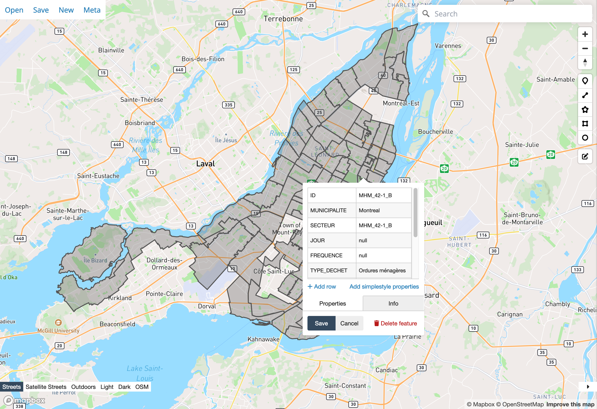

# Montreal

Waste collection schedules provided by [Info Collecte Montreal](https://montreal.ca/info-collectes/).

## Configuration via configuration.yaml

```yaml
waste_collection_schedule:
  sources:
    - name: montreal_ca
      args:
        sector: SECTOR
        food: SECTOR_A
        recycling: SECTOR_B
        green: SECTOR_C
        bulky: SECTOR_D
```

### Configuration Variables

* **sector** *(string) (required)*
* **food** *(string) (optional)*
* **recycling** *(string) (optional)*
* **green** *(string) (optional)*
* **bulky** *(string) (optional)*

**How do I find my sector?**

- Download on your computer a [Montreal GeoJSON file](https://donnees.montreal.ca/dataset/2df0fa28-7a7b-46c6-912f-93b215bd201e/resource/5f3fb372-64e8-45f2-a406-f1614930305c/download/collecte-des-ordures-menageres.geojson)
- Visit https://geojson.io/
- Click on *Open* and select the Montreal GeoJSON file
- Find your sector on the map



## Example

French calandar labels

```yaml
waste_collection_schedule:
  sources:
    - name: montreal_ca
      calendar_title: Info-Collecte
      args:
        sector: MHM_41-1
      customize:
        - type: Waste
          alias: Ordures
        - type: Food
          alias: Composte
        - type: Recycling
          alias: Recyclage
        - type: Green
          alias: Feuilles mortes et résidus vert
        - type: Bulky
          alias: Encombrants et résidus de construction
```
